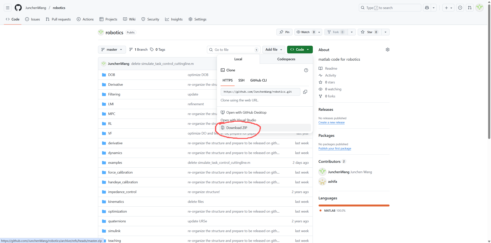
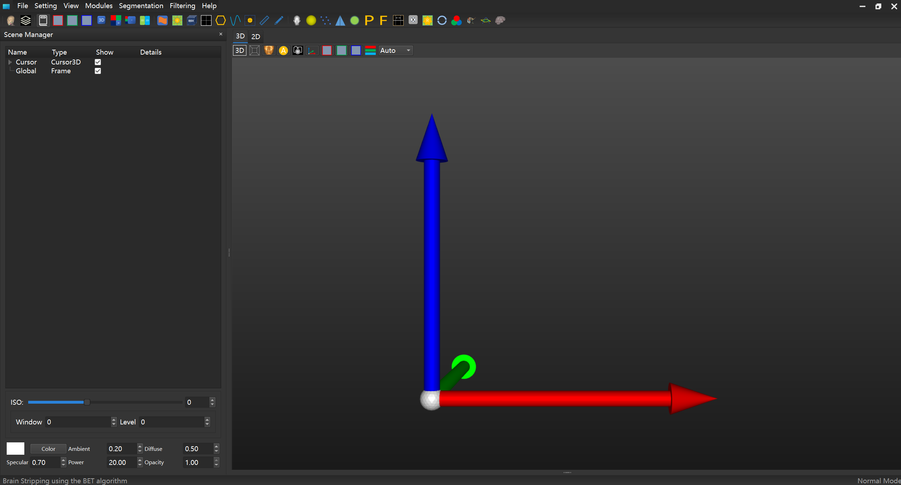
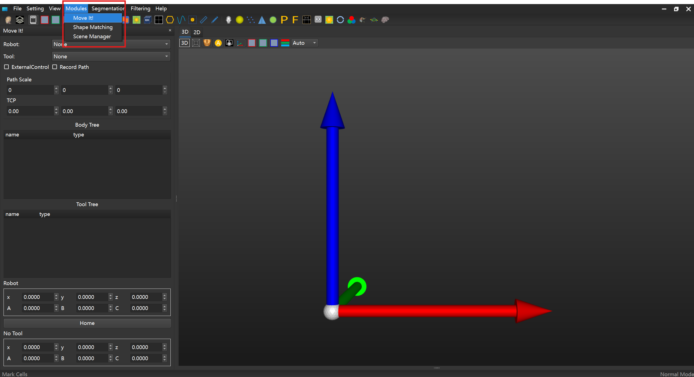
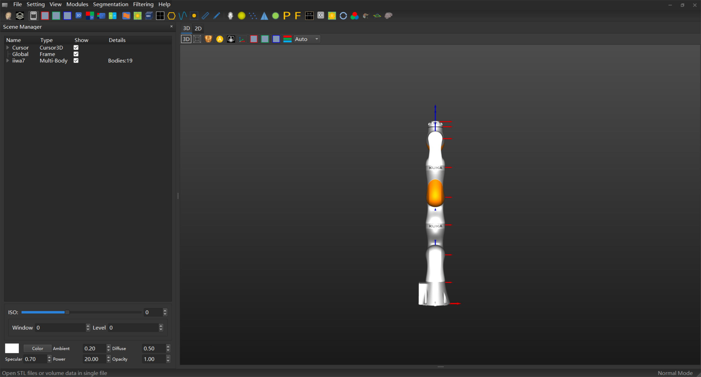
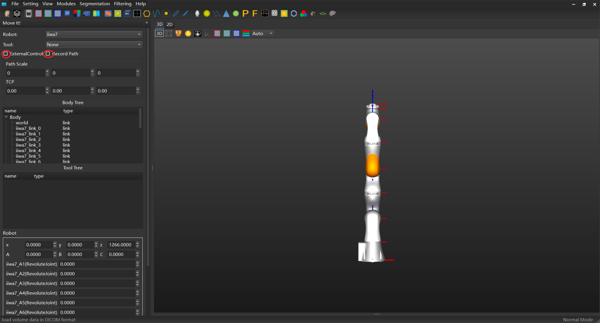
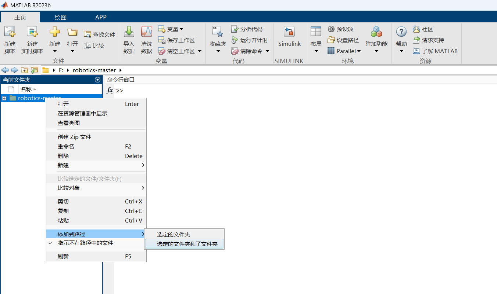
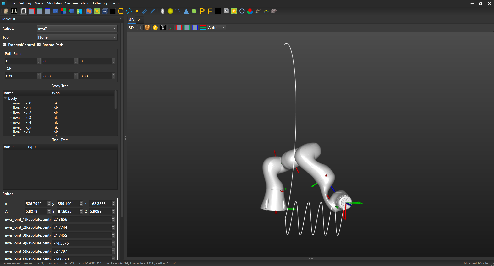

# robotics

This is the robotics matlab code repository developed by Junchen Wang at Beihang University.

## 环境要求

Windows 10以上， MATLAB（例如：MatlabR2023b）。

## 快速开始

### 下载

将本项目源代码的zip文件下载到本地，解压缩。

或使用git获取源代码

```
git clone https://github.com/JunchenWang/robotics.git
```

注意：请勿下载到包含中文字符的路径下。

### 安装

在utilities文件夹中找到并解压“MICsys-6.rar”，在解压后的文件夹内双击“launcher.exe”，即可启动仿真环境。

### 测试

1. 启动仿真环境，选择菜单栏“Modules”，选中“Move It！”。
2. 选择菜单栏“Flies”，选中“Open”，选择“urdf\iiwa7”路径下的“iiwa7.urdf”文件。
3. 左侧面板“Robot”下拉菜单中选择“iiwa7”，勾选“ExternalControl”（开启与matlab联合仿真）和“Record Path”（记录末端路径，再次点击可消除路径）。
4. 打开MATLAB，将项目文件夹及其子文件夹添加到系统路径。
5. 在MATLAB中，运行velocity_control文件夹中的“simulate\_task\_control.m”文件，可以看到如下仿真效果。
